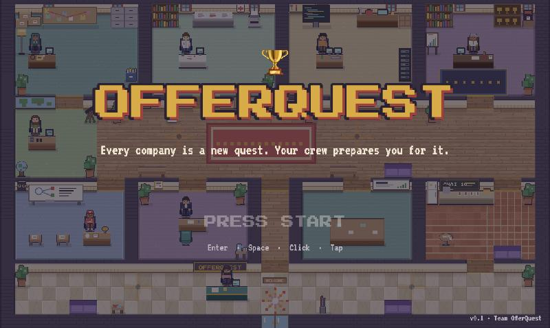
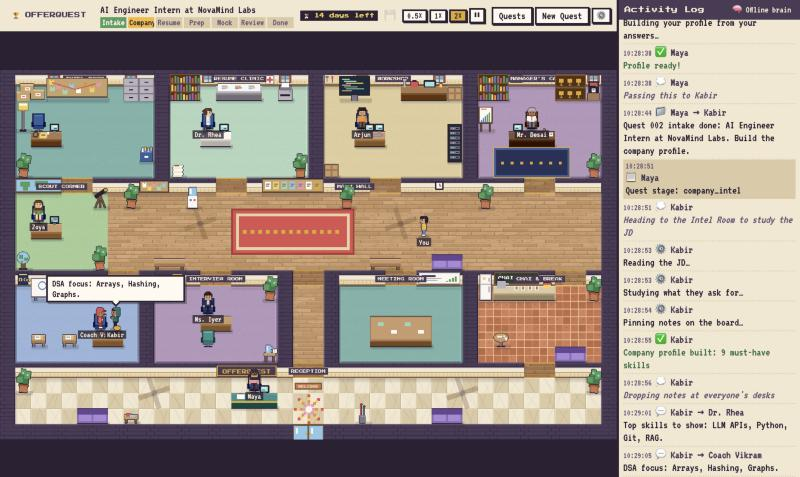
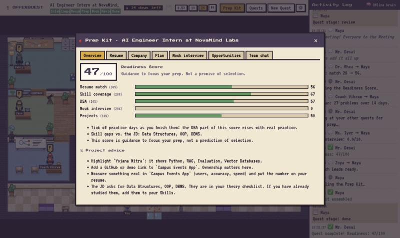

<div align="center">

# 🏆 OfferQuest

### *Every company is a new quest. Your crew prepares you for it.*

**A pixel-art office where eight AI agents walk, talk, argue over your resume,<br>and get you ready for one specific company's interview.**



`▶ PRESS START`

</div>

---

## 📜 The story so far

You're a student. Placement season is coming. You have one generic resume, no idea what the company actually tests, and nobody to mock-interview you.

So you walk into a small pixel office, and eight people look up from their desks.

They read the job description. They read your resume (the actual PDF). They walk across the hall to ask each other questions. One of them sends your resume back because a bullet has no numbers. Another makes you sit a mock interview. And at the end they hand you a **Prep Kit** built for *that* company.

Nothing happens off-screen. If an agent does it, you watch them do it.



---

## 👥 Meet the crew

| | Who | Class | Special move |
|---|---|---|---|
| 🙋 | **Maya** | Career Counselor | Reads your resume, asks instead of guessing, runs the team |
| 🕵️ | **Kabir** | Company Analyst | Turns a job description into evidence, and labels where every clue came from |
| 📄 | **Dr. Rhea** | Resume Doctor | Red pen. Rewrites bullets. **Never invents a skill or a number** |
| 🛠️ | **Arjun** | Project Advisor | Picks which of your projects to lead with, and what to build next |
| 🧮 | **Coach Vikram** | DSA Coach | Day-by-day practice plan. Walks with a bounce |
| 🎤 | **Ms. Iyer** | Interview Coach | Mock interview in the company's style. Scores honestly |
| 🔭 | **Zoya** | Opportunity Scout | Finds where to look for openings. Never makes one up |
| 📊 | **Mr. Desai** | Progress Manager | Sends weak work back. Computes your Readiness Score |

Between quests they wander off for chai and talk shop. That part is not productive. It is, however, accurate.

---

## 🗺️ How a quest goes

```
 INTAKE ──▶ COMPANY INTEL ──▶ RESUME ──▶ PREP ──▶ MOCK ──▶ REVIEW ──▶ 🎉 DONE
   🙋            🕵️          📄 🛠️ 📊    🧮 🔭      🎤      everyone
```

1. **Hand Maya your resume.** She reads the PDF and shows you what she found.
2. **Name the company and paste the job description.**
3. **Watch.** 💭 thought bubbles say what an agent is about to do. 📁 folders get carried across the office.
4. **Answer when someone needs you.** A ❓ pauses the quest. They wait.
5. **Collect the loot** 👇



### 🎒 Loot: the Prep Kit

- 📄 A resume tailored to this company (PDF and DOCX), with a before → after match score
- 📝 A change log: every edit, and why
- 🕵️ The company profile, each insight tagged 🟢 from the JD · 🟡 common for the role · 🔴 a guess
- 🧮 A day-by-day practice plan you tick off
- 🎤 A mock interview report, with retakes
- 📊 A Readiness Score out of 100 (guidance, not a promise)

---

## 🎮 Controls

| Do this | And this happens |
|---|---|
| **Click an agent** | See who they are, what they're doing, and give them a task |
| **Double-click the floor** | Your character walks there |
| Spot a bouncing **!** | That agent has something for you |
| Scroll / drag | Zoom and pan the office |
| `0.5×` `1×` `2×` `⏸` | Slow down, speed up, pause |

---

## 📊 Character sheet

```
QUEST LOG ─────────────────────────────────────────────
 Agents on the crew ........................... 8
 Rooms in the office .......................... 9
 Animations per character ..................... 11 poses × 4 directions
 Image files used for art ..................... 0   (it's all drawn in code)
 Backend tests passing ........................ 25
 Evaluation quests ............................ 20

STATS (20-quest evaluation, offline brain) ─────────────
 Resume match, before      ███████░░░░░░░░░░░░░  33.5
 Resume match, one agent   ███████░░░░░░░░░░░░░  36.0
 Resume match, the crew    ████████░░░░░░░░░░░░  40.5
 Faithfulness              ████████████████████  100%
 Actions shown on screen   ████████████████████  100%
```

*Faithfulness* means nothing on the tailored resume was invented. *The crew vs. one agent* is the same work done by a single agent with no teammates. The crew's edge is real but modest, and the evaluation JDs are written by us in the style of campus postings, not copied from real ones.

---

## ✅ Achievements unlocked

- [x] 🎬 Game-style entry: loading screen → title → **PRESS START** → menu
- [x] 🚪 Intro cutscene: doors open, Maya waves, you build your avatar, the crew introduce themselves
- [x] 📄 Resume upload that really reads the PDF (two-column layouts included)
- [x] 🤝 Agents ask, answer, hand off, review and send work back
- [x] 🧭 Ask any agent anything: the crew routes it to whoever owns it
- [x] 🛡️ A checker that reverts any resume line containing a skill or number you didn't give
- [x] ☕ Chai breaks with small talk
- [x] 💾 Save slots, and quests that survive a server restart
- [x] ⏪ Replay any finished quest · 🕹️ arcade-style demo on the title screen
- [x] 🌙 Day and night by the real clock, rain in monsoon months
- [x] 🎙️ Voice mock interview (browser speech, off by default)

## 🔒 Side quests still locked

- [ ] Hand-drawn art (today everything is procedural)
- [ ] A public deployment (configs are in `docs/deploy.md`; nothing is hosted yet)
- [ ] Logins. Save slots are open to anyone who can reach the server
- [ ] Real public job descriptions in the evaluation set, and testing with real students
- [ ] Prompt tuning on Gemini, which has had only light use so far

---

## 🕹️ Two ways to play

The same code runs with two different brains.

| | 🧠 Offline brain | ✨ Gemini brain |
|---|---|---|
| Needs | Nothing | A free Google Gemini API key |
| Thinking | Built-in rules, no AI calls | Gemini, with the rules as a safety net |
| Mock interview scoring | A rubric: length, specifics, structure | Judged on what you actually said |
| Good for | Trying it out, demos, tests | Real prep |

### Start it

```bash
python3.12 -m venv .venv
.venv/bin/pip install -r backend/requirements.txt
cd frontend && npm install && cd ..
```

**Offline brain** — no key needed:

```bash
GEMINI_API_KEY= .venv/bin/uvicorn backend.main:app --port 8000
```

**Gemini brain** — copy `.env.example` to `.env`, add your key, then:

```bash
.venv/bin/uvicorn backend.main:app --port 8000
```

Then, in a second terminal:

```bash
cd frontend && npm run dev
```

Open **http://localhost:5173**, press Start, and choose **New Quest**. No resume handy? Use **Try it with a sample resume** or **Fill with demo data**.

> 💡 The free Gemini tier is small: a quest uses roughly 8–10 calls. If the quota runs out mid-quest, the crew quietly switches to the offline brain for ten minutes.

To run both at once on different ports, see the four entries in `.claude/launch.json`.

---

## 🧰 Under the hood

```
frontend/   Phaser 3 scenes + React panels + a Tiled map of the office
    ▲ WebSocket: what to animate          │ REST: what the student does
backend/    FastAPI · LangGraph workflow · 8 agents · message bus · SQLite · ChromaDB
```

One rule holds it together: **the backend decides, the game only animates.**

| Want to… | Look at |
|---|---|
| Read the original idea | [`OfferQuest.md`](OfferQuest.md) |
| See what was built, phase by phase, and what's still rough | [`Implementation.md`](Implementation.md) |
| Run the tests | `.venv/bin/pytest` |
| Run the evaluation | `.venv/bin/python eval/run_eval.py` |
| Watch a quest in the terminal | `.venv/bin/python -m backend.cli` |
| Rearrange the office | open `frontend/public/assets/maps/office.json` in [Tiled](https://www.mapeditor.org/) |
| Check licenses | [`CREDITS.md`](CREDITS.md) |

---

<div align="center">

*OfferQuest: because every student deserves a crew in their corner.* 🏆

</div>
